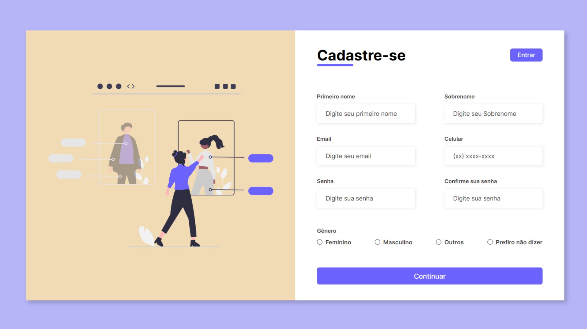

# Formulário de Cadastro

## Projeto 💻
Projeto desenvolvido por meio de um vídeo no YouTube do canal da Larissa Kich.
- YouTube: [Formulário de Cadastro RESPONSIVO (Responsive Registration Form) | HTML e CSS](https://youtu.be/zWw0npNDkVM?si=oRz3XGFAQRWT0Tve)

## Instalação 🛠
Siga esses passos para instalar o repositório:
1. Rode `git clone https://github.com/dudaishiyama/Formulario-de-Cadastro` para fazer um clone desse repositório.
2. Abra o arquivo HTML.

## Tecnologias 🚀
As tecnologias utilizadas nesse projeto são:
- HTML
- CSS
- Google Fonts

## Créditos ❤️
Feito por [Duda Ishiyama](https://github.com/dudaishiyama/).